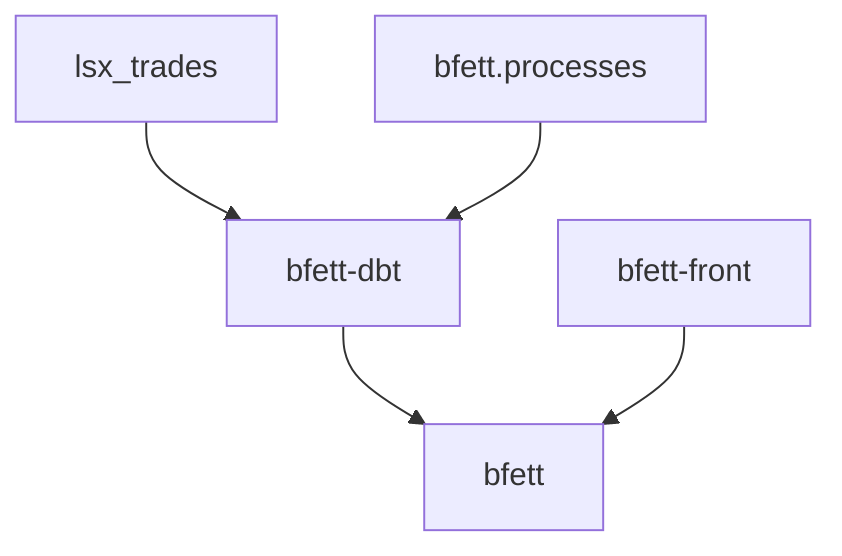

# bfett -- Portfolio Projekt

## Überblick



## Installation

### Docker

Das Projekt benötigt docker, das wie folgt installiert wird.

```
sudo apt update
sudo apt install docker.io
sudo usermod -aG docker $USER  # Erlaubt Docker ohne sudo (nach Neustart wirksam)
newgrp docker  # Sofort wirksam ohne Logout
sudo apt install docker-buildx # legacy build decprecated
docker --version  # Überprüfen
```

### bfett Repo

Dieses Repo (im Wesentlichen das Skript bfett) muss heruntergeladen werden.

Angenommen, das Projekt soll im Ordner ~/bfett installiert werden.

```
cd ~
git clone https://github.com/kweinert/bfett.git
chmod +x ./bfett
ln -s ~/bfett/bfett ~/bin/bfett 
```

### dbt backend

Das Repo [bfett-dbt](https://github.com/kweinert/bfett-dbt) kümmert sich um das Datenmanagement.

Angenommen, das Projekt soll im Ordner ~/bfett installiert werden.

```
cd ~/bfett
git clone https://github.com/kweinert/bfett-dbt.git
bfett build dbt
```

### R shiny frontend

Das Repo [bfett-front](https://github.com/kweinert/bfett-front) kümmert sich um die Visualisierung.

Angenommen, das Projekt soll im Ordner ~/bfett installiert werden.

```
cd ~/bfett
git clone https://github.com/kweinert/bfett-front.git
bfett build front
```

